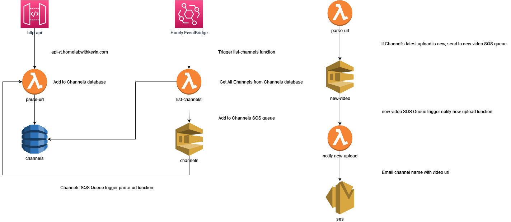

# Description

I'm learning Terraform Cloud and Serverless functions.

I've wanted to make a server-less YouTube downloader for a long time and definitely a lot of from other projects: [Inspiration](https://github.com/hxrsmurf/ytdlp-flask-nextjs#inspiration--based-on).

# Diagram
draw.io diagram. I may use mermaid later.

